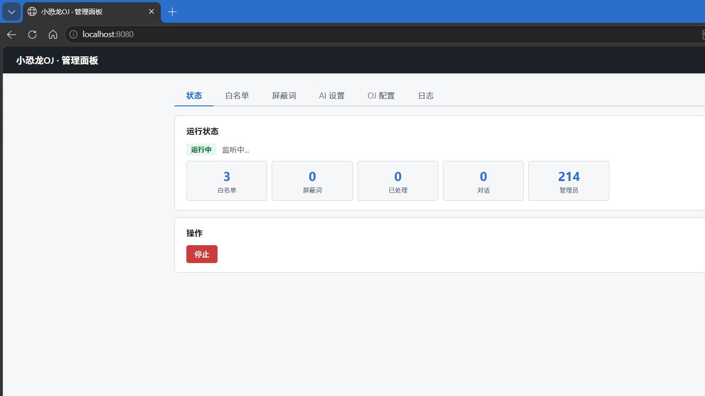

# 🦕 HydroAI

Hydro OJ 站内消息 AI 自动回复机器人 + Web 管理面板

## ✨ 功能



- 🤖 **AI 自动回复** — 监听 OJ 站内消息，调用 DeepSeek API 流式生成回复
- 🧠 **思考过程实时显示** — AI 推理过程实时显示在 Web 面板
- 💬 **对话上下文** — 记忆最近 6 轮对话，AI 能理解上下文
- 👥 **白名单管理** — 添加/删除白名单用户，支持备注
- 🚫 **屏蔽词系统** — 自定义屏蔽词，AI 输出自动打码
- 🛠️ **全功能 Web 面板** — 控制台日志实时显示、启停控制、配置修改

## 🚀 快速开始

### 1. 安装

```bash
pip install requests pyinstaller
```

### 2. 配置

编辑 `settings.json`，填入你的 OJ 账号和 AI API Key：

```json
{
    "oj": {
        "username": "your_oj_username",
        "password": "your_oj_password",
        "base_url": "https://hydro.ac"
    },
    "ai": {
        "api_key": "sk-your-deepseek-api-key",
        "api_url": "https://api.deepseek.com/v1/chat/completions",
        "model": "deepseek-v4-flash"
    }
}
```

### 3. 运行

```bash
python main.py
```

打开浏览器访问 **http://localhost:8080** 进入管理面板。

首次使用输入任意账号密码，自动保存为管理员凭证。

### 打包 exe

```bash
pip install pyinstaller
pyinstaller --onefile --name "HydroAI" main.py
```

## 📁 项目结构

```
HydroAI/
├── main.py             入口（集成 Web 管理面板）
├── web_server.py       Web 管理面板模块
├── bot.py              机器人主逻辑
├── config.py           配置管理
├── oj_client.py        OJ API 封装
├── ai_client.py        AI 客户端（流式回复）
├── command_parser.py   命令解析
└── settings.json       配置文件（本地，不入库）
```

## 📋 更新日志

### v1.2.1 (2026-06-14)

- 🐛 **修复 token 消耗信息进入对话记忆** — AI 回复不再附带 `[消耗 x tokens]`，避免 AI 模仿此格式
- ✨ **新增状态查询功能** — 管理员可通过 `#状态` 或自然语言询问运行时长、处理消息数、DeepSeek 余额等
- 🌐 **DeepSeek 余额实时查询** — 通过官方 API 获取账户余额，数据真实可靠

### v1.2.0 (2026-06-13)

- 🐛 **修复首次运行崩溃** — 修复 `config.py` 中 `DEFAULT_CONFIG` 的 `_comment` 字段导致 `dict()` 构造失败的 Bug
- ⚡ **提升稳定性** — 改用 `copy.deepcopy` 安全创建默认配置，不再因配置字段类型差异崩溃
- 🚀 打包为单 exe 文件即可运行，首次启动自动生成 `settings.json`

### v1.1.2

- 自动创建默认配置，移除仓库中的 settings.json

### v1.1.1

- 彩虹色 ASCII 艺术字，HydroAI 品牌重命名，自动识别管理员

## 🔧 技术栈

- Python 3.12
- DeepSeek API（流式）
- Python 标准库 `http.server`（零依赖 Web 面板）
- PyInstaller（打包 exe）
